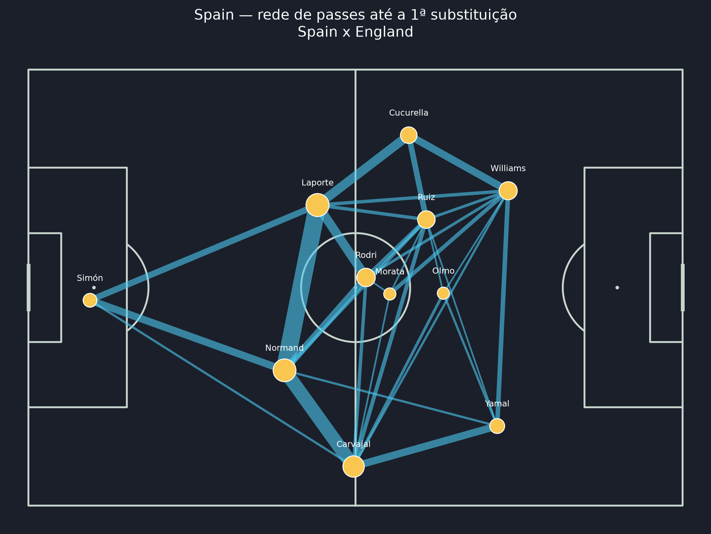
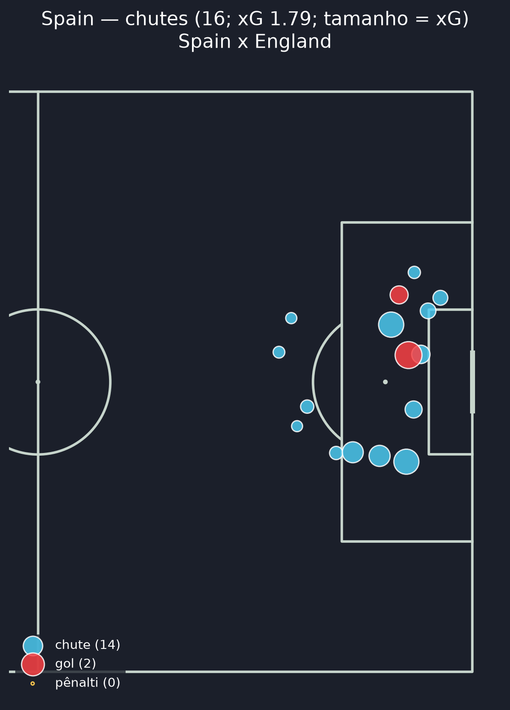
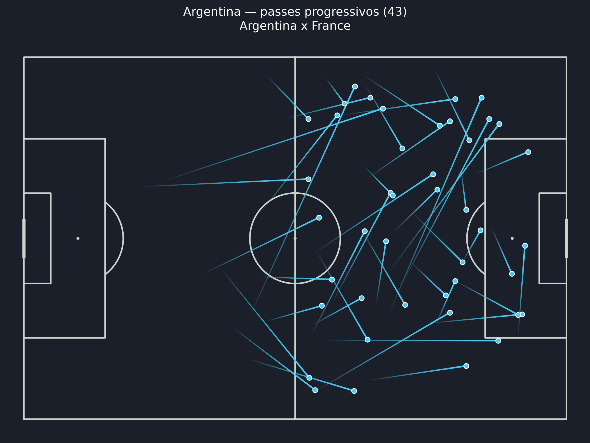
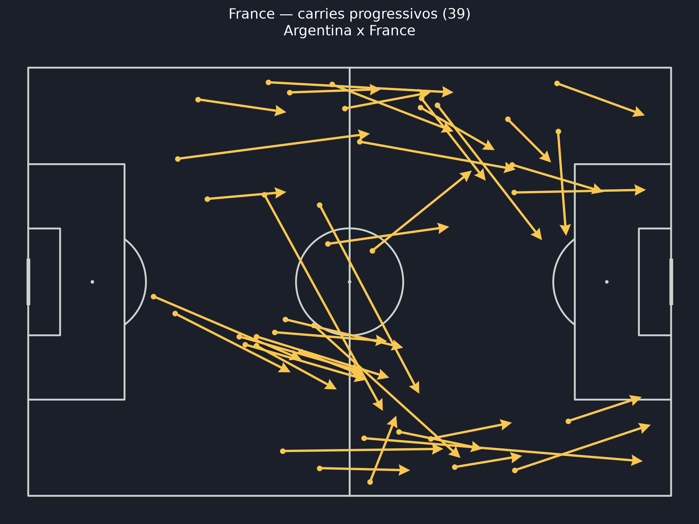
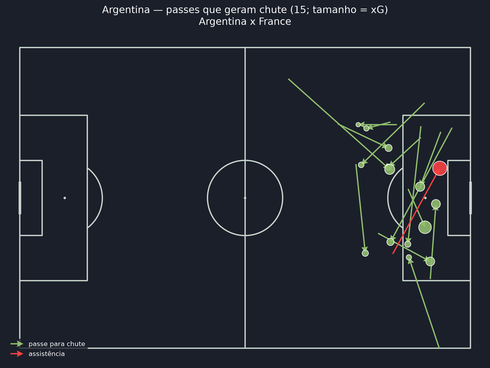
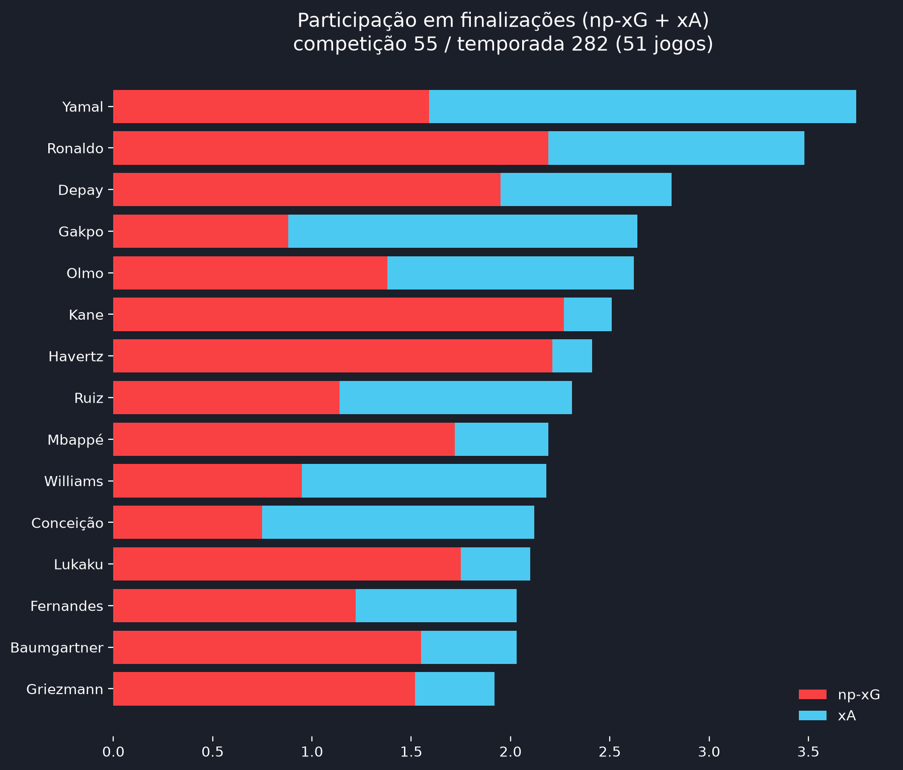

# ⚽ Football Tactical Analytics

Pipeline de análise tática de futebol com dados abertos da [StatsBomb](https://github.com/statsbomb/open-data):
**statsbombpy → pandas → DuckDB (em memória) → SQL analítico → mplsoccer**, com um front end em Streamlit
para explorar qualquer partida ou campeonato inteiro.



## O que ele faz

| Análise | Query SQL | Visualização |
|---|---|---|
| **Mapa de chutes** (posição, xG, gols, pênaltis) | [`shots.sql`](sql/shots.sql) | meio-campo de ataque, tamanho = xG |
| **Passes progressivos** (critério estilo Wyscout) | [`progressive_passes.sql`](sql/progressive_passes.sql) | mapa de passes |
| **Carries progressivos** (≥ 10 jardas em direção ao gol) | [`progressive_carries.sql`](sql/progressive_carries.sql) | mapa de conduções |
| **Passes-chave** com xA (passe → chute via `shot_key_pass_id`) | [`key_passes.sql`](sql/key_passes.sql) | mapa de passes-chave (tamanho = xG) |
| **Participação em finalizações** (chutes, xG, **np-xG**, xA) | [`shot_participation.sql`](sql/shot_participation.sql) | tabela / gráfico |
| **Rede de passes** (até a 1ª substituição) | [`pass_network_nodes.sql`](sql/pass_network_nodes.sql), [`pass_network_edges.sql`](sql/pass_network_edges.sql) | rede por time |
| **Resumo por jogador e por time** (vários jogos) | [`tournament_summary.sql`](sql/tournament_summary.sql), [`team_summary.sql`](sql/team_summary.sql) | tabelas / ranking |

Uma query por arquivo `.sql`; as de resumo reaproveitam o resultado das outras, então cada definição
(por exemplo, "progressivo") vive em um só lugar.

<table>
  <tr>
    <td></td>
    <td></td>
  </tr>
  <tr>
    <td></td>
  </tr>
  <tr>
    <td></td>
    <td></td>
  </tr>
</table>

## Instalação

```bash
python -m venv .venv && source .venv/bin/activate   # Windows: .venv\Scripts\activate
pip install -r requirements.txt pyarrow
```

## Uso

### Front end

```bash
streamlit run app.py
```

Na barra lateral escolha **campeonato → temporada → partida** (ou **campeonato inteiro**).

- **Partida:** placar, métricas por time (gols, xG, np-xG, chutes, precisão de passe, progressões),
  tabela de jogadores (com minutos) e mapas de chutes, passes/carries progressivos, passes-chave e rede de passes.
- **Campeonato inteiro:** ranking de jogadores (filtro por time, mínimo de jogos e de minutos, métrica por total ou por 90, exporta CSV)
  e tabela agregada por time.

### Linha de comando

```bash
python main.py                                       # final da Copa 2022 (padrão)
python main.py pick                                  # menus interativos
python main.py competitions --search "champions"     # acha competition_id / season_id
python main.py matches 16 4                          # lista jogos (match_id)
python main.py analyze 22912 --competition-id 16 --season-id 4
python main.py analyze-season 55 282 --min-matches 3 [--maps] [--limit N]
```

Os mapas vão para `outputs/<match_id>/` e o resumo do campeonato para `outputs/season_<comp>_<season>/`
(`player_summary.csv` + gráfico). Os eventos ficam em cache em `data/` (use `--refresh` para rebaixar).

## Definições

Campo StatsBomb 120 × 80, gol atacado em (120, 40).

- **Passe progressivo:** passe completo em jogo corrido que reduz a distância ao gol em ≥ 30% (origem e
  destino no próprio campo), ≥ 15% (cruza o meio-campo) ou ≥ 10% (no campo adversário).
- **Carry progressivo:** condução que reduz a distância ao gol em ≥ 10 jardas e termina fora dos 40%
  defensivos do campo.
- **Minutos jogados:** calculados a partir das escalações (entradas/saídas), incluindo acréscimos e
  prorrogação. As métricas "/ 90" usam esses minutos.
- **xA:** xG do chute gerado pelo passe. **np-xG:** xG sem pênaltis.
- Disputas de pênaltis (período 5) ficam fora das contagens de chutes e gols.
- Rótulos dos jogadores vêm do `player_nickname` das escalações (exceções em `SHORT_NAMES`).

## Publicar online (Streamlit Community Cloud)

1. Suba o repositório no GitHub (público ou privado).
2. Em [share.streamlit.io](https://share.streamlit.io), entre com o GitHub e clique em **Create app**.
3. Escolha o repositório, a branch `main` e o arquivo principal `app.py`.
4. Em **Advanced settings**, selecione Python 3.12 e confirme em **Deploy**.

As dependências vêm de `requirements.txt` e o tema de `.streamlit/config.toml`. O primeiro carregamento de
cada partida/campeonato baixa os dados da API (um campeonato inteiro leva ~1 min); o disco do servidor é
temporário, então o cache em `data/` se refaz após cada reinício. Depois de publicado, coloque o link no topo
deste README.

## Estrutura

```
├── app.py                     # front end Streamlit
├── main.py                    # CLI
├── .streamlit/config.toml     # tema do app
├── sql/                       # uma query analítica por arquivo
├── src/football_analytics/
│   ├── config.py              # IDs padrão, dimensões do campo, apelidos
│   ├── extract.py             # statsbombpy + cache em parquet
│   ├── transform.py           # limpeza e carga no DuckDB
│   ├── queries.py             # execução das queries SQL
│   ├── viz.py                 # mapas com mplsoccer
│   └── pipeline.py            # orquestração (partida e temporada)
├── docs/img/                  # imagens deste README
├── data/                      # cache dos eventos (ignorado no git)
└── outputs/                   # PNGs e CSVs gerados (ignorado no git)
```

## Limitações

- Os minutos vêm das escalações; se faltarem em jogos antigos, o app esconde o filtro de minutos.
- Algumas temporadas só têm os jogos de um time (ex.: Bundesliga = Bayer Leverkusen); o app avisa.
- Só há eventos para as competições do Open Data (a Champions, por exemplo, vai até 2018/19).
- A rede de passes é por partida; posições médias não fazem sentido somadas entre jogos.

## Créditos

Dados: [StatsBomb Open Data](https://github.com/statsbomb/open-data) — ao usar ou publicar análises,
siga os [termos de uso e atribuição](https://github.com/statsbomb/open-data/blob/master/doc/Open%20Data%20Terms%20of%20Use.pdf)
da StatsBomb.
